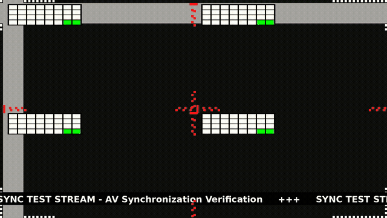

# sync-test-gen

A toolkit for generating video streams with overlay patterns for AV synchronization testing. Renders a binary frame counter, scrolling bars, sync dots, alignment grid, scrolling ticker, and snow/noise pattern on top of background video content, then encodes to H.264/H.265/AV1.



## Prerequisites

- Python 3.8+
- FFmpeg (with `libx264`, optionally `libx265`, `libaom-av1`)
- Pillow (`pip install Pillow`)

## Installation

```bash
# Install system dependencies (Debian/Ubuntu)
sudo apt-get install -y python3 python3-pip ffmpeg

git clone https://github.com/hackboxguy/sync-test-gen.git
cd sync-test-gen
pip install -r requirements.txt
```

## Sample Video

[Tears of Steel](https://mango.blender.org/) (CC-BY 3.0, Blender Foundation) works well as background video:

```bash
# Download Tears of Steel 1080p (~560MB, H.264, 1920x800, 24fps)
wget -P assets/ http://ftp.nluug.nl/pub/graphics/blender/demo/movies/ToS/tears_of_steel_1080p.mov
```

Other mirrors: [ftp.halifax.rwth-aachen.de](http://ftp.halifax.rwth-aachen.de/blender/demo/movies/ToS/tears_of_steel_1080p.mov) | [blender-mirror.kino3d.org](http://blender-mirror.kino3d.org/mango/download.blender.org/demo/movies/ToS/tears_of_steel_1080p.mov)

## Quick Start

```bash
# Generate 100 frames with all overlays on blue background
python3 generate.py generate --frames 100 --output test.mkv

# Generate full-length video from input (auto-detects frame count)
python3 generate.py generate \
  --input assets/tears_of_steel_1080p.mov \
  --output sync_test.mkv

# Generate specific number of frames at 60fps
python3 generate.py generate \
  --input video.mp4 \
  --frames 500 \
  --framerate 60 \
  --output sync_test.mkv

# Skip first 10 seconds of input video
python3 generate.py generate \
  --input video.mp4 \
  --start-time 10 \
  --output sync_test.mkv

# Custom ticker text instead of default image
python3 generate.py generate \
  --input video.mp4 \
  --ticker-text "MY SYNC TEST STREAM" \
  --output sync_test.mkv

# Binary counters in all 4 quadrants (2x2 video wall mode)
python3 generate.py generate \
  --input video.mp4 \
  --quad-counters \
  --output sync_test.mkv

# Frame number overlay with quad counters
python3 generate.py generate \
  --input video.mp4 \
  --frame-number \
  --quad-counters \
  --output sync_test.mkv

# Stream an encoded file via RTP
python3 generate.py stream sync_test.mkv 232.22.7.86:3000
```

## Example: Creating a 60fps Sync Test Video

A step-by-step example using Tears of Steel as the background:

```bash
# 1. Extract a 30-second clip starting at 60s into the movie
ffmpeg -ss 60 -i assets/tears_of_steel_1080p.mov -t 30 \
  -c:v libx264 -preset fast -an /tmp/tos_30sec.mov

# 2. Generate a 60fps sync test video with selected overlays
python3 generate.py generate \
  --input /tmp/tos_30sec.mov \
  --framerate 60 \
  --frame-number \
  --quad-counters \
  --ticker-text "SYNC TEST STREAM" \
  --no-snow --no-sync-dots \
  --output /tmp/sync_test_60fps.mkv

# 3. Verify the output
ffplay /tmp/sync_test_60fps.mkv
```

This produces a 1080p video at 60fps with quad binary counters, scrolling bars, alignment grid, a human-readable frame number, and a custom ticker message — suitable for video wall sync testing.

## Commands

### `generate` — Create a sync test video

```
python3 generate.py generate [options] --output FILE
```

**Video options:**

| Option | Default | Description |
|--------|---------|-------------|
| `--resolution WxH` | `1920x1080` | Output resolution |
| `--framerate FPS` | `30` | Frame rate in fps |
| `--frames N` | auto / `1000` | Number of frames (default: full input video length, or 1000 if no input) |
| `--codec` | `h264` | Video codec: `h264`, `h265`, or `av1` |
| `--bitrate BR` | `4M` | Encoding bitrate |
| `--output FILE` | *(required)* | Output video file path |

**Input options:**

| Option | Description |
|--------|-------------|
| `--input FILE` | Video file to use as background (if omitted, solid blue background) |
| `--start-time SECONDS` | Skip first N seconds of input video |

**Overlay options (all enabled by default):**

| Option | Default | Description |
|--------|---------|-------------|
| `--no-bars` | | Disable scrolling bars |
| `--bar-width N` | `100` | Bar width in pixels |
| `--bar-speed N` | `5` | Bar scroll speed in px/frame |
| `--no-sync-dots` | | Disable sync dots |
| `--sync-dot-count N` | `3` | Number of dots per side |
| `--no-grid` | | Disable alignment grid |
| `--quad-counters` | | Draw binary counter at top-left of each quadrant (2x2 video wall layout) |
| `--frame-number` | | Show human-readable frame number overlay |
| `--frame-number-pos X,Y` | top-right | Frame number position in pixels |
| `--no-ticker` | | Disable scrolling ticker |
| `--ticker-speed N` | `10` | Ticker scroll speed in px/frame |
| `--ticker-text TEXT` | | Custom ticker text (overrides `--ticker-image`) |
| `--ticker-image FILE` | `assets/custom-ticker.tga` | Ticker image file |
| `--no-snow` | | Disable snow/noise |
| `--snow-pixel-size N` | `32` | Snow block size in pixels (0 = disable) |
| `--snow-coverage N` | `100` | Snow area as % of screen |

### `stream` — RTP stream a video file

```
python3 generate.py stream INPUT_FILE IP:PORT
```

Streams the encoded video file in a loop via RTP/UDP using FFmpeg. Press Ctrl+C to stop.

## Notes

**Framerate and input video**: The `--framerate` option sets the output framerate independently of the input video's native framerate. If the input is 24fps and the output is 60fps, the background video will play faster than real-time (each input frame is used once, no duplication or interpolation). This is by design — the purpose of the tool is to produce smooth, glitch-free test patterns with a unique binary counter on every frame, not to preserve the original playback speed of the background content.

## Overlay Elements

- **Binary Counter**: 32-bit frame number as 8x4 colored rectangle grid (green=1, white=0). Default: single counter at bottom-left. With `--quad-counters`: one counter at the top-left of each screen quadrant (2x2 video wall layout).
- **Frame Number**: Human-readable decimal frame number (e.g., `0042`) with black outline for visibility. Enabled with `--frame-number`, position adjustable with `--frame-number-pos X,Y`.
- **Scrolling Bars**: Gray vertical + horizontal bars moving across the frame. Wraps at edges.
- **Sync Dots**: Red dots scrolling along edges in all 4 screen quadrants.
- **Alignment Grid**: White checkered squares at frame corners for picture alignment verification.
- **Scrolling Ticker**: Horizontally scrolling strip near top of frame. Use `--ticker-text` for custom text or `--ticker-image` for an image file.
- **Snow/Noise**: Random RGB pixel blocks centered on screen.

## License

MIT
